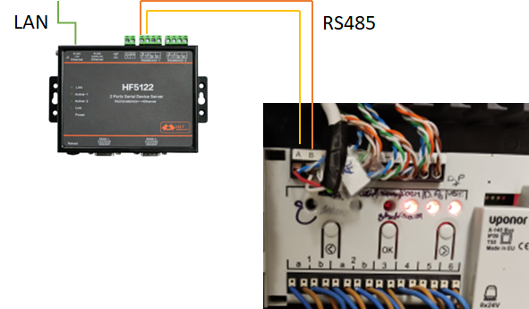
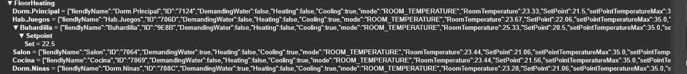
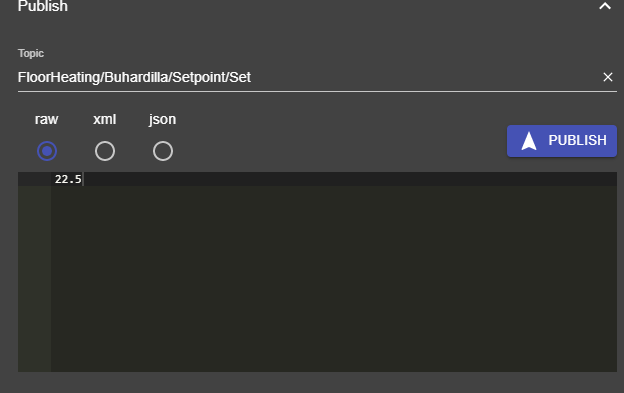

# Uponor to MQTT

Monitor Uponor thermostats and control thermostats setpoint individually when there is no BMS support in the controller.

## Credits

The development of this software has been possible with the help of the EEVblog Electronics Community Forum. There is a post (https://www.eevblog.com/forum/projects/figuring-out-an-rs485-protocol/) started by `alanambrose` in which the reverse engineering process is almost done due to the help of `alanambrose`, `jsouto`, `mitokondoria`, `dimmu311` and `TBuyukkilic` among others.

## Disclaimer (mains, circuit manipulation)
The use of this hardware and software requires interacting with devices that are connected to 120/220V so it may be dangerous. 

Be cautious and disconnect any device from the mains before going on.

**Whenever a circuit is manipulated and something goes wrong, you may brick your system making it unusable** If you go on, it will be on you own responsibility. 

**So, we take NO RESPONSABILITY AT ALL for any personal or device damage.** 


## Disclaimer (IPR)

This project has been carried out as an academic and/or recreational project and shared as-is. If there is any kind of IPR regarding the bus, hardware, devices, or any piece of software you think its usage in this documentation or software is infringing any copyright, registered utility model or any other kind of protection, let us know and we will remove the code and the information as soon as possible.

## Disclaimer (code quality)

Despite it works, there are many aspects of this software that have not been thoroughly tested. 

There should be a more elegant way to do this in general (sure) and to better integrate this in OpenHab (more than sure), but this way was comfortable to me...

Do not hesitate to enlighten me about how this software can be improved.


## Application:

Monitor Uponor thermostats and control thermostats setpoint individually when there is no BMS support in the controller.


Uponor FloorHeating (and cooling) systems require a controller that uses a Modbus like (not real Modbus AFAIK) to communicate with thermostats spread over the house. 

I guess the protocol would be the same (or quite similar) even for wireless thermostats (probably with less updates to save battery), but I could only test this with wired ones. 

It has been tested using the smatrix base unit (X.145) and T-146 thermostats.


According to the document entitled “Uponor Smatrix Base PRO Controller X-147 Modbus RTU interface” (that can be easily found on the internet), PRO models (as X-147) can be connected to a BMS (as Openhab using modbus binding) and controlled according to the information on the document (very easy, and the way to go if you are lucky and have a PRO model).


For those who have a controller with no external BMS connection, as my case, we must tap the bus, as in a MITM attack, and do some reverse engineering.

## Usage

### Hardware:

You will need any kind of serial port (RS485/RS232) server (i.e. HF5122) to interface with the controller connected this way:



I used 19200,8,1,NONE (speed, data bits, stop bits, parity) for the RS485 port configuration (this servers have the option to process Modbus directly, but it does not work for me, so let the server send you all the bytes without processing). 

Other people have reported not "magic" frequencies (as 19680bps) but those than cannot be selected in commercial serial server ports (in those cases and additional element as esp32 with RS485 hardware can be used but this guide is not covering it).

### Software components

The software comprises the following components:
-	TCP Client: that gets the information from the serial port server
-	Bus: that estimates the bus idle time (to inject frames to change the setpoint temperature)
-	Frame processor: with the help of a Frame Parser, it extracts data form the bus, discovers thermostats and provides the information to a MQTT client
-	MQTT client: posts the values to a MQTT topic and subscribes to a child topic (per thermostat) to receive setpoint values.

The software can be downloaded from here: https://github.com/ddsuc3m/uponor-floorheating

### How to use it

In your linux terminal, go to you account and clone the project:

```
git clone https://gitlab.gast.it.uc3m.es/automation/uponor-floorheating.git
cd uponor-floorheating
```

Then compile the code:

```
mvn clean
mvn install
```

Form `uponor-floorheating` folder, then create a folder where to run the server (**as root**) and copy the files you need (as shown):

```
mkdir -p /opt/modbusparser
cp target/modbusparser-0.0.1-SNAPSHOT.jar /opt/modbusparser/.
cp config.yaml.tmpl /opt/modbusparser/config.yaml
cp deps.sh /opt/modbusparser/.
cp run.sh  /opt/modbusparser/.
cp modbusparser.service /opt/modbusparser/.
```

Go to `/opt/modbusparser`, edit `config.yaml` with your configuration (the file has a description on the most important fields) Don't worry if you don't know the IDs of the thermostats, you can see them in MQTT and find it out later.

Then, download the dependencies:

```
bash deps.sh
```

Edit the launching script (if you changed the destination folder and it is not `/opt/modbusparser`). It looks like the following:

```
#!/bin/bash

JAVA_HOME=/usr/lib/jvm/zulu11
WORKDIR=/opt/modbusparser/
CLASSPATH="/opt/modbusparser/modbusparser-0.0.1-SNAPSHOT.jar:/opt/modbusparser/deps/gson-2.9.0.jar:/opt/modbusparser/deps/jsr305-3.0.2.jar:/opt/modbusparser/deps/org.eclipse.paho.client.mqttv3-1.2.5.jar:/opt/modbusparser/deps/snakeyaml-1.30.jar"
CLASSNAME="modbusparser.TCPClient"
JAVA_OPTIONS=" -Xms256m -Xmx512m -server -cp $CLASSPATH"
APP_OPTIONS=" /opt/modbusparser/config.yaml"

cd $WORKDIR
"${JAVA_HOME}/bin/java" $JAVA_OPTIONS $CLASSNAME $APP_OPTIONS $1

```

Give execution permissions to the script:

```
chmod u+x /opt/modbusparser/run.sh
```

**Inspect mode**

Test the application by running `bash /opt/modbusparser/run.sh inspect` so you can see the traffic. And if everything goes fine, find out the identity of every thermostat and update fiendlynames accordingly. Then kill the application and create a service.

The service script provided is `modbusparser.service`. You may need to change it if installed the application to other place. Otherwise (for `/opt/modbusparser`) it looks like the following:

```
[Unit]
Description=Modbusparser uponor
After=syslog.target network.target

[Service]
# from https://www.baeldung.com/linux/run-java-application-as-service
# The JVM designers made Java return a non-zero exit code in case it is terminated by a system signal.
# As a non-zero base, they took 128, and the resulting exit code is a sum of 128 and the signal numeric value.
# By setting SuccessExitStatus to 143, we tell systemd to handle that value (128+15) as a normal exit.
SuccessExitStatus=143
User=root
Group=root

Type=simple

ExecStart=bash /opt/modbusparser/run.sh
ExecStop=/bin/kill -15 $MAINPID

[Install]
WantedBy=multi-user.target
```

Install the service:

```
cp /opt/modbusparser/modbusparser.service /etc/systemd/system/modbusparser.service
sudo systemctl daemon-reload

```

Test it:

```
sudo systemctl start  modbusparser
```

If everything goes fine, install it!

```
sudo systemctl enable  modbusparser
```

### Update

Just go to the folder in which you cloned the project and run:

```
systemctl stop modbusparser
git pull
```

Then recompile and move the new jar file:

```
mvn install
cp target/modbusparser-0.0.1-SNAPSHOT.jar /opt/modbusparser/.

```


Then run (as root):

```
systemctl start modbusparser
```

## MQTT and OpenHAB

### MQTT 

Once the service is running, you can connect to your MQTT broker and see what is going on:



You can use MQTT tools to find out (by changing the setpoint and having a look to the Room Temperature) which ID corresponds to a given thermostat and give a friendly name to it in the `config.yaml` file. Otherwise use the inspect mode as described before.

You can also play with the system and change the setpoint:




### OpenHAB integration

Coming soon (but using MQTT... you are on your own!)

